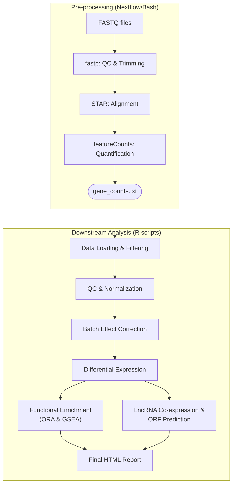

# 🧬 RNA-seq Analysis Pipeline


This repository contains a complete **RNA-seq analysis pipeline**, covering everything from raw data quality control to advanced functional interpretation.

The pipeline is implemented in **Nextflow** (with an optional Bash fallback) for high-performance data processing, and **R** for downstream exploratory analysis, normalization, differential expression, and functional enrichment. It is designed for **reproducibility** using Docker or Singularity containers.

## 📋 Features

### 🔹 Processing Pipeline (Nextflow/Bash)
* **Trimming & QC:** Automated reads trimming using **fastp**.
* **Alignment:** High-speed alignment using **STAR**.
* **Quantification:** Gene counting with **featureCounts**.
* **Optimization:** Automatic reuse of existing STAR genome indexes to save time.

### 🔹 Analysis Pipeline (R)
* **Exploratory Analysis:** Quality control, PCA, and hierarchal clustering.
* **Normalization:** Batch-effect correction and variance stabilization.
* **Differential Expression:** Robust identification of DE genes.
* **Functional Enrichment:** ORA (Over-Representation Analysis) & GSEA (Gene Set Enrichment Analysis).
* **LncRNA Analysis:** Co-expression networks and ORF prediction.
* **Reporting:** Automated generation of an interactive **RMarkdown** report.

## 🔄 Workflow Overview



## 📂 Repository Structure

```text
rnaseq-pipeline/
├── Dockerfile                   # Container definition (fastp, STAR, featureCounts, Nextflow, R/renv)
├── nextflow.config              # Nextflow configuration (modules + fallback containers)
├── main.nf                      # Nextflow workflow implementation
├── run_pipeline.sh              # Optional Bash pipeline
├── samplesheet.csv              # Example input samplesheet
├── genome/                      # Reference genome FASTA + annotation
│   ├── GRCh38.primary_assembly.genome.fa
│   └── gencode.v48.primary_assembly.annotation.gtf
├── genome_index/                # STAR genome index (generated/reused)
├── fastq/                       # Raw FASTQ files
├── fastp_reports/               # fastp QC reports (.html, .json)
├── output/                      # Outputs from the processing pipeline
│   ├── trimmed/                 # Trimmed FASTQ files
│   ├── aligned/                 # BAM files from STAR
│   └── counts/                  # Gene counts (featureCounts)
├── results/                     # Downstream R analysis results
└── scripts/                     # R analysis scripts
    ├── 00_run_all_analysis.R    # Master script
    ├── 01_load_filter_data.R
    ├── ... (QC, Normalization, DE)
    ├── 14_render_report.R
    └── rna_seq_report.Rmd       # RMarkdown template
```

## 🚀 Usage

### 1. Build Docker Image
Ensure you have Docker installed and build the image:

```bash
docker build -t rnaseq_pipeline:latest .
```
> **Note:** On HPC systems without Docker, **Singularity** images will be used automatically if configured in `nextflow.config`.

### 2. Run Pipeline (Processing)

You can choose between the **Bash** script (stable) or **Nextflow** (beta).

**Option A: Bash Pipeline**
```bash
docker run --rm -v /path/to/project:/data rnaseq_pipeline:latest \
           /bin/bash /data/run_pipeline.sh
```

**Option B: Nextflow Pipeline**
```bash
# Local execution
nextflow run main.nf -c nextflow.config

# With Docker
docker run --rm -v /path/to/project:/data rnaseq_pipeline:latest \
           /opt/nextflow/nextflow run /data/main.nf -c /data/nextflow.config
```

### 3. Run Downstream Analysis (R)

Once `gene_counts.txt` is generated (from the previous step), place it in the project root directory and execute the master R script:

```bash
Rscript scripts/00_run_all_analysis.R
```

This will sequentially execute all scripts in `/scripts`, generating tables and plots in `/results`, and producing the final **`rna_seq_report.html`**.

## ⚙️ Configuration

* **Nextflow:** Adjust parameters in `nextflow.config`.
* **Bash:** Adjust parameters at the top of `run_pipeline.sh`.
* **R Dependencies:** Managed via **renv** (lockfile included).

## 📝 Notes

* **Index Reuse:** Existing STAR genome indexes are automatically detected and reused to save computational time.
* **HPC Compatibility:** The pipeline is designed to work with local HPC modules or Containers (Singularity/Docker) for maximum flexibility.

---
&copy; 2025 Santiago T. Ariza
